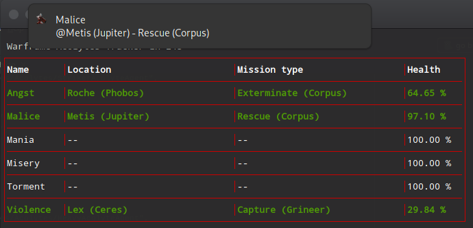

Warframe Acolytes Tracker
=========================

[](https://travis-ci.org/kodeart/warframe-acolytes)

Warframe Acolytes Tracker is a command-line application
for tracking the appearance of the Stalker's acolytes.



Enjoy!

Usage
-----

[Download the ZIP file][1], unzip it anywhere you like, run the binary for your operating system.

| OS               | executable      |
|------------------|-----------------|
| Windows (64 bit) | acolytes.exe    |
| Linux            | acolytes-linux  |
| MacOS            | acolytes-darwin |

```shell script
cd path/to/warframe/acolytes/folder
```
```shell script
# Windows
acolytes.exe track -n
```
```shell script
# Linux
$ ./acolytes-linux track -n
```
```shell script
# MacOS
$ ./acolytes-darwin track -n
```
_Tip: you may rename the binary to `acolytes` for Linux/MacOS_

### Examples

- `track` command without arguments will run the tracker **without notifications and sound**
> acolytes.exe track

- the tracker can send operating system notifications when the acolyte is discovered.
This option is **off** by default. **To enable** notifications, run with `-n` flag
> acolytes.exe track -n

- if notifications are enabled, a beep sound will play. **To disable sound** run with `-s` (silent) flag
> acolytes.exe track -ns

### World check frequency

You can use the `--refresh` or `-r` flag to set the seconds for
world-state check, if you feel that 30s default is too frequent. Ex:
```shell script
acolytes.exe track -n -r 60
``` 
will scan the world state every 60 seconds, You cannot set it below 30.

### Build from source

- checkout the source code
- run `./build.sh`
- the binaries are in the `./releases` folder

License
-------
[](LICENSE)


[1]: https://github.com/kodeart/warframe-acolytes/releases/latest
